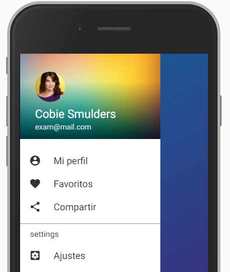

# JSwipe
###### v 1.0


Create a beauty and practical nav drawer (like material drawer) easily

Direct Library Links:
* https://e1016.github.io/JSwipe/drawer.min.js
* https://e1016.github.io/JSwipe/drawer.min.css

## Requirements

[material icons](https://material.io/icons/) and [Roboto Font](https://fonts.google.com/specimen/Roboto) is necessary for the correct functioning. You can view here an [live example](https://e1016.github.io/JSwipe/) the gestures only works for **mobile devices**


---

## Use

To begin, we will need include 2 HTML tags in our document, this tags will work as reference for JavaScript.

```HTML
<span class="__modal_drawer"></span> <!-- 1 -->
<div id="drawer_js"></div> <!-- 2 -->
```

1. ( __modal_drawer ) <- semi transparent background than appears when menu is triggered, for lock the background content
2. ( drawer_js ) <- main content for drawer

---

Our drawer is initilized with `init` method, from `Drawer` and recives an object than contains 2 main nodes, header section named `main` and items (menu options) section named `menu` example:

```JS
Drawer.init({
  main: // header,
  menu: // menu-items
})

```
`main` node must contain an object with the next options:

```JS
main: {
  background: 'sources/bg.jpg',        // <- main background path (cover photo)
  photo: 'sources/cobie-smulders.jpg', // <- photo profile path
  title: 'Cobie Smulders',             // <- user name
  subtitle: 'exam@mail.com',           // <- email or user mote
}
```

`menu` node recives an object, where each item is defined with the next structure

```JS
menu: [{
    icon: 'account circle', // <- define item icon
    label: 'Mi perfil',     // <- define item label
    action: '/profile'      // <- URL route or function
  },{
    separator: 'settings'  // <- separator
  },{
    icon: 'share',
    label: 'Compartir',
    action: share   // <- add pointer to `function share() {...}` it will be executed on click event
}]
```

1. `icon:` recives a String, the name is getted from [material icons library](https://material.io/icons/)
2. `label:` recives a String, conatains label for menu item
3. `action:` this element can recives a path (URL|route) or a function, for function we pass a reference, without "quotation marks" and () parenthesis, anonymous functions are not supported for now
4. `separator:` recives a String used for name a section

## Final

Drawer totally configured:

```JS
Drawer.init({
  main: {
    background: 'sources/bg.jpg',
    photo: 'sources/cobie-smulders.jpg',
    title: 'Cobi Smulders',
    subtitle: 'exam@mail.com'
  },
  menu: [{
    icon: 'account_circle',
    label: 'Profile',
    action: '/profile'
  },{
    icon: 'favorite',
    label: 'Favorite',
    action: '/favorite'
  },{
    icon: 'share',
    label: 'Share',
    action: share
  },{
    separator: 'settings'
  },{
    icon: 'settings_applications',
    label: 'Settings',
    action: '/settings'
  }]
})
```
---

It is posible include a trigger for display the nav drawer, setting the **mdrawer_trgger** id in any tag of your HTML, example:

```HTML
<button id="mdrawer_trgger">menú</button>
```

